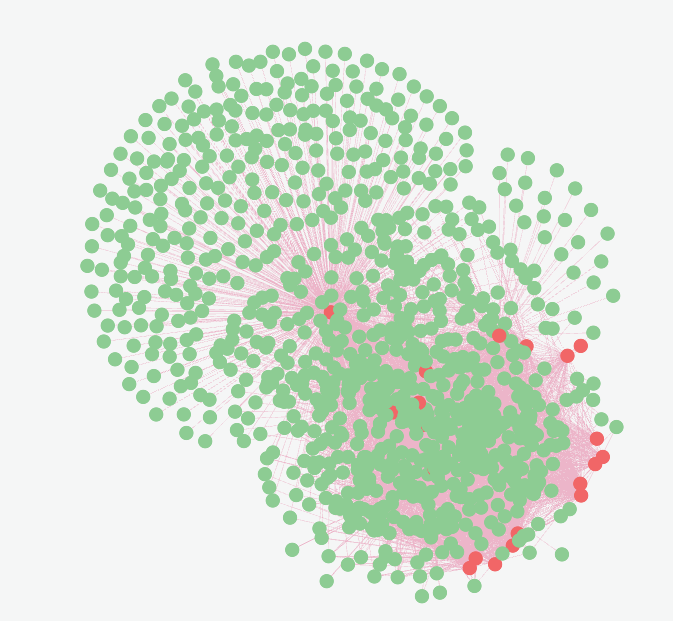

# Harsh Vardhan Gupta

This repo stores the files for the Fintech coding assessment.

I will also take the time to write down my thoughts and planning process taken place during solving each of the process.


## Medium difficulty Questions
### Q1) Extractor 
The entry point of this file is the `getURLContent`
```py
def getURLContent(csv_file_path:str, output_file_path:str)->dict:
    loop = asyncio.get_event_loop()
    output = loop.run_until_complete(__url_Iterator(csv_file_path))
    with open(output_file_path, 'w') as f:
        json.dump(output, f)
```
```py
from Extractor import Extractor

Extractor.getURLContent("FinCatch_Sources_Medium.csv", "output.json")
```
The Extractor asynchronously parses wikipedia and investopedia articles in the `csv_file_path`, and then calls HKUST's OPENAI API to summarise the body content of the reponse.\
The `getURLContent` once it finishes parsing all the website and summarising it, serialises into JSON format and writes into `output_file_path`

### Q2) Causal Relationship Visualizer
